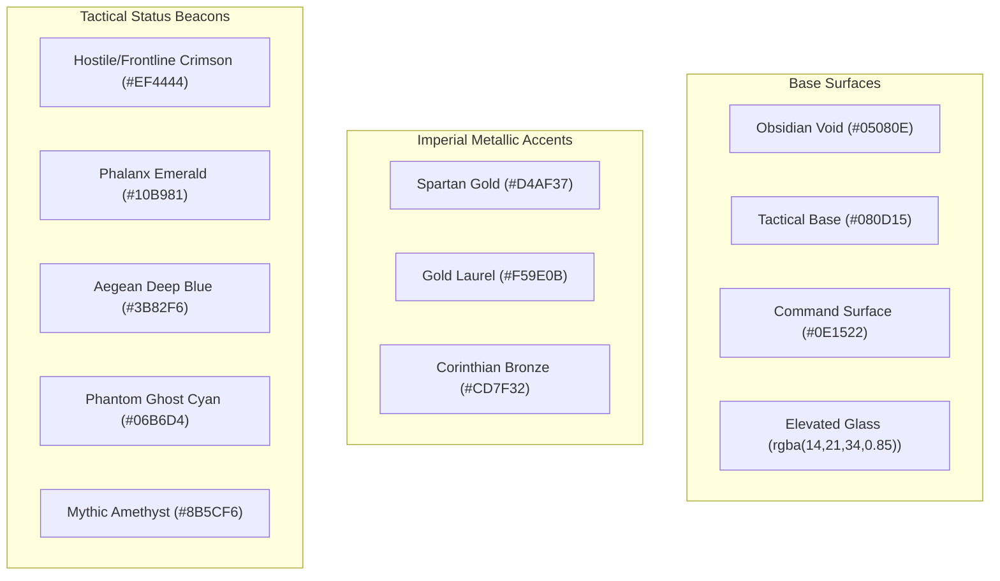
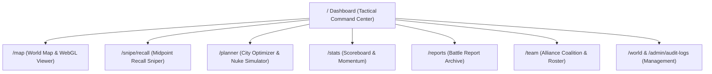

# Grepolis Tactical Command Suite — Master UI/UX Design System & Redesign Specification (DESIGN.md)

> **Document Status**: Complete & Authoritative Specification  
> **Target Audience**: Expert UI Engineer / Agent, Frontend Designers, Product Leads  
> **Design Philosophy**: *Strategos Command System* — Ancient Greek Hellenic Military Atmosphere blended with High-Performance Glassmorphic Tactical Dark Theme.

---

## 1. Executive Summary & Brand Identity

### 1.1 The Product
The **Grepolis Tactical Command Suite** (`GrepoTools`) is a military-grade intelligence and tactical execution platform for competitive Grepolis players, alliance leaders, and world strategists. It provides real-time WebGL interactive world maps, political Voronoi territorial dominance heatmaps, precision midpoint recall sniping calculators, automated city specialization planners, battle report ingestion archives, and cross-alliance coalition coordination.

### 1.2 The Core Problem
The current UI suffered from fragmented incremental development:
- **Generic SaaS Tech Aesthetic**: Over-reliance on generic purple/blue tech gradients and neon accents, completely disconnected from the classical antiquity, bronze, and stone lore of Grepolis.
- **Root Layout Constraint Hacking**: The global layout forced a fixed max-width container (`<main className="container">`) on all pages, forcing the World Map and Scoreboard to break out with `position: fixed; top: 64px; left: 0; right: 0; bottom: 0;` hacks.
- **Visual & UI Collisions**: Overlapping sidebars, minimaps colliding with alliance lists, table search inputs rendered directly over table headers, clipping Recharts labels, and input icons overlapping placeholder text.
- **Information Overload & Sprawl**: The Scoreboard contains 8 redundant search boxes on a single view; the City Planner displays 26 unclassified raw text inputs without iconography; the Dashboard wastes 50% of the viewport on static links duplicating the navbar.
- **Mobile Non-Viability**: On mobile, drawers occupy 100% of the viewport, modals cut off without scroll indicators, and the map canvas becomes unnavigable.

### 1.3 The Design Vision: *The Strategos Command System*
A unified, cohesive, imperial dark theme:
- **Aegean Obsidian Foundations**: Deep maritime slate and obsidian night surfaces (`#070A0F`, `#0B111A`) that eliminate eye strain during multi-hour siege nights.
- **Classical Metallics & Grecian Accents**: Spartan Imperial Gold (`#D4AF37`, `#F3C644`), Corinthian Bronze (`#CD7F32`), and Weathered Laurel trims replacing generic purple tech gradients.
- **Hellenic Military Hierarchy**: Typography that pairs classical antiquity lapidary headers (`Outfit` / `Cinzel` uppercase tracking) with razor-sharp tactical monospace tabular digits (`JetBrains Mono` / `tabular-nums`) for timing and coordinates.
- **Full Viewport Flexibility**: Clean distinction between **Full-Viewport Canvas Archetypes** (Map, Scoreboard) and **Structured Command Consoles** (Planner, Sniper, Dashboard, Admin), sharing a unified glassmorphic HUD component language.

---

## 2. Comprehensive UI/UX Audit Findings

The following audit was conducted across live Chromium DevTools inspection, mobile emulation (390px iPhone / 768px iPad), and source code AST analysis.

### 2.1 Critical Architectural & Layout Deficiencies

| ID | Issue | Impact | Root Cause |
|---|---|---|---|
| **ARC-01** | `layout.js` forces `<main className="container">` globally | Severe | `src/app/layout.js` line 31 forces `max-width: 1440px; padding: 1.25rem 1rem` on every route. Map (`/map`) and Scoreboard (`/stats`) are forced to use `position: fixed; top: 64px; left: 0; right: 0; bottom: 0; zIndex: 10;` breakout hacks. |
| **ARC-02** | Left Sidebar & Minimap Radar Collide on `/map` | Critical | On `/map`, the collapsible left sidebar (288px) and the minimap radar canvas (220px) share the lower-left viewport without z-index or flex coordination, rendering world stats and alliances directly across the minimap. |
| **ARC-03** | Navbar Overcrowding on Viewports < 1440px | High | The desktop navbar renders 9 navigation links, world selector, player badge, sync button, sync status pill, user role pill, and logout button on a single line. It wraps awkwardly and clips controls on laptops. |
| **ARC-04** | Dual Divergent Snipe Pages (`/snipe` vs `/snipe/recall`) | Moderate | `/snipe` is an abandoned legacy launch queue with ad-hoc styles (`btn-primary`), while `/snipe/recall` is the actual active midpoint sniper. Users clicking external links land on disparate designs. |
| **ARC-05** | Mobile Viewport Complete Breakdown on `/map` | Critical | On 390px mobile screens, `CommandDrawer` renders at `width: 420px; max-width: 100vw;`, permanently eclipsing the map canvas with no swipe-to-dismiss gesture. |

### 2.2 Visual Polish, Alignment & Component Bugs

| ID | Location | Visual / UX Bug | Screenshot Evidence |
|---|---|---|---|
| **VIS-01** | `Input.jsx` (Global) | **Icon Overlaps Placeholder Text**: Left icon (`<Icon size={16} />`) overlaps placeholder text (`e.g. Leonidas` on Login, `Track Target City...` on Sniper). | Visible in `/login` and `/snipe/recall`. `pl-9` with negative SVG centering clips standard font glyphs. |
| **VIS-02** | `/stats` (Scoreboard) | **Recharts Label Collisions**: Horizontal bar charts on Momentum render `LabelList` inside the bar right over the category names (`+529 426` overlays `előretolt helyő`). | Visible in all 6 momentum panels. YAxis tick width is hardcoded to 100px. |
| **VIS-03** | `/stats` (Scoreboard) | **8 Redundant Search Inputs**: Every single one of the 6 chart panels has its own individual search input, plus global player search, plus global alliance search. | Clutters layout, confuses users, and triggers 8x keyboard event handlers. |
| **VIS-04** | `/team` (Team Page) | **Search Input Vertically Overlaps Table Header**: The roster search input is placed with absolute/relative coordinates that overlay the `OPERATIVE` table header by 50%. | Table header text is physically unreadable behind input border. |
| **VIS-05** | `/admin/audit-logs` | **Filter Inputs Touch Table Header**: Filter row has zero bottom margin, causing `TIMESTAMP` column header to touch the input frame. | Visual misalignment and poor hierarchy. |
| **VIS-06** | `DeepDiveModal.js` | **Modal Bottom Clipping**: Modal body lacks bottom padding and flex scroll clamping; Conquest History list cuts off midway through row items. | Modal content overflows border with no visual fade or scroll shadow. |
| **VIS-07** | Dashboard (`/`) | **Number Formatting Spacing Glitch**: Numbers formatted with `toLocaleString()` render wide spaces (`569  662`) due to browser font glyph kerning in JetBrains Mono. | Must use `tabular-nums` and standardized `Intl.NumberFormat('en-US')`. |
| **VIS-08** | `/planner` | **26 Raw Text Inputs Without Icons**: Nuke composition simulator is a wall of 26 text inputs with Hungarian localized names and no unit visual sprites. | Monotonous, unengaging, and hard to parse at a glance. |
| **VIS-09** | `src/app/globals.css` | **Hardcoded CSS Duplication & Legacy Resets**: Mix of Tailwind 4 theme variables, CSS root variables, and inline `style={{ ... }}` objects with direct DOM mutations (`onMouseEnter`). | Inconsistent theming, prevents dark mode token unification. |
| **VIS-10** | Global (a11y) | **Missing Form Field Labels & Names**: Chromium DevTools reports multiple form fields without `<label>` or `id`/`name` attributes. | Severe screen-reader and accessibility violation. |

---

## 3. Design System & Theming: *The Strategos System*

### 3.1 Color Palette & Semantic Tokens

The color palette is built on **Hellenic Military Realism** — deep obsidian stone, bronze armor, warm gold laurels, and high-visibility tactical beacons.



#### Complete CSS Token Definitions (`src/app/globals.css`)

```css
@import "tailwindcss";

@theme {
  /* Surfaces & Backgrounds */
  --color-surface-void: #05080e;
  --color-surface-base: #080d15;
  --color-surface-card: #0e1522;
  --color-surface-elevated: #141d2e;
  --color-surface-overlay: rgba(8, 13, 21, 0.88);
  --color-surface-hover: rgba(255, 255, 255, 0.04);
  --color-surface-active: rgba(255, 255, 255, 0.08);

  /* Borders & Dividers */
  --color-border-subtle: rgba(255, 255, 255, 0.06);
  --color-border-default: rgba(255, 255, 255, 0.10);
  --color-border-strong: rgba(255, 255, 255, 0.18);
  --color-border-bronze: rgba(205, 127, 50, 0.25);
  --color-border-gold: rgba(212, 175, 55, 0.35);

  /* Typography */
  --color-text-primary: #f8fafc;
  --color-text-secondary: #94a3b8;
  --color-text-muted: #64748b;
  --color-text-gold: #f3c644;
  --color-text-bronze: #e09f67;

  /* Imperial Metallics (Grepolis Brand Accents) */
  --color-spartan-gold: #d4af37;
  --color-spartan-gold-hover: #e5c158;
  --color-spartan-gold-muted: rgba(212, 175, 55, 0.15);
  --color-corinthian-bronze: #cd7f32;
  --color-corinthian-bronze-muted: rgba(205, 127, 50, 0.15);

  /* Tactical Status Beacons */
  --color-tactical-crimson: #ef4444;       /* Enemy attacks, lost towns, hot frontlines */
  --color-tactical-crimson-glow: rgba(239, 68, 68, 0.25);
  --color-tactical-emerald: #10b981;       /* Friendly defense, acquisitions, verified */
  --color-tactical-emerald-glow: rgba(16, 185, 129, 0.25);
  --color-tactical-aegean: #3b82f6;        /* Naval movements, standard towns, info */
  --color-tactical-aegean-glow: rgba(59, 130, 246, 0.25);
  --color-tactical-phantom: #06b6d4;       /* Ghost towns, dummy targets, radar scans */
  --color-tactical-phantom-glow: rgba(6, 182, 212, 0.25);
  --color-tactical-mythic: #a855f7;        /* Flying mythic units, elite alliances */
  --color-tactical-mythic-glow: rgba(168, 85, 247, 0.25);
  --color-tactical-amber: #f59e0b;         /* Active revolt, pending windows, warning */

  /* Fonts */
  --font-sans: var(--font-outfit), system-ui, -apple-system, sans-serif;
  --font-mono: var(--font-mono), monospace;
  --font-display: var(--font-cinzel), serif, var(--font-outfit);
}
```

### 3.2 Glassmorphism & Elevation System

Instead of flat borders and blurry washed-out white overlays, use **Layered Obsidian Glass**:
- **Elevation Level 0 (Canvas Void)**: `#05080E` (Map canvas, page background).
- **Elevation Level 1 (Panels & Shell)**: `background: rgba(14, 21, 34, 0.85); backdrop-filter: blur(16px); border: 1px solid rgba(255, 255, 255, 0.08); box-shadow: 0 8px 32px rgba(0, 0, 0, 0.55);`
- **Elevation Level 2 (Cards & Active Toolbars)**: `background: rgba(20, 29, 46, 0.90); backdrop-filter: blur(20px); border: 1px solid rgba(212, 175, 55, 0.15); box-shadow: 0 12px 40px rgba(0, 0, 0, 0.65);`
- **Elevation Level 3 (Modals & Flyouts)**: `background: rgba(11, 17, 28, 0.98); backdrop-filter: blur(24px); border: 1px solid rgba(212, 175, 55, 0.28); box-shadow: 0 24px 64px rgba(0, 0, 0, 0.85);`
- **Metallic Edge Shimmer**: Subtle top-border gradient:
  ```css
  border-image: linear-gradient(to right, rgba(212, 175, 55, 0.3), rgba(255, 255, 255, 0.08), rgba(205, 127, 50, 0.3)) 1;
  ```

### 3.3 Typography Hierarchy

1. **Brand & Page Hero Title**:
   - Font: `var(--font-sans)` with `font-bold` or `var(--font-display)`.
   - Size: `text-2xl` to `text-3xl` (`24px` to `30px`).
   - Treatment: Clean white with subtle gold glow or metallic gradient (`from-white via-slate-100 to-amber-200/90`).
2. **Section Headings**:
   - Font: `var(--font-sans)`, `font-bold`, uppercase, tracking: `tracking-wider`.
   - Size: `text-xs` (`11px` to `12px`).
   - Color: `text-slate-400` or `text-amber-400/90`.
3. **Tactical Numeric Data (Points, Coordinates, Timers, Pop)**:
   - Font: `var(--font-mono)`, `font-bold`, `tabular-nums`.
   - Size: `text-sm` to `text-2xl`.
   - Numbers MUST use `Intl.NumberFormat('en-US')` (e.g., `24,284,175` instead of `24 284 175`).
4. **Body & Controls**:
   - Font: `var(--font-sans)`, `font-medium`.
   - Size: `text-xs` to `text-sm` (`12px` to `14px`).

---

## 4. Layout Architecture & Viewport Archetypes

### 4.1 Root Layout Re-architecture (`src/app/layout.js`)

**CRITICAL FIX**: Remove `<main className="container">` from `RootLayout`!

```jsx
// src/app/layout.js
export default function RootLayout({ children }) {
  return (
    <html lang="en" className={`${outfit.variable} ${jetbrainsMono.variable}`}>
      <body className="bg-surface-void text-text-primary min-h-screen flex flex-col antialiased selection:bg-spartan-gold/30 selection:text-white">
        <AppContextProvider>
          <Navigation />
          {/* Unconstrained full-width flex child */}
          <div className="flex-1 flex flex-col relative w-full overflow-x-hidden">
            {children}
          </div>
        </AppContextProvider>
      </body>
    </html>
  );
}
```

### 4.2 Two Canonical Layout Archetypes

#### Archetype A: Full-Viewport Canvas (`/map`, `/stats`)
- **Container**: `h-[calc(100vh-64px)] w-full overflow-hidden relative flex`.
- No outer margins or scrollbars.
- Sidebars, HUD panels, and search bars float over the canvas with explicit z-index layers and collapsible transitions.

#### Archetype B: Structured Command Console (`/`, `/planner`, `/snipe/recall`, `/reports`, `/team`, `/world`, `/admin/*`)
- **Container**: Uses standard `<PageContainer>` primitive.
- Max-width: `max-w-7xl` (`1280px`) or `max-w-6xl` (`1152px`), centered with `mx-auto px-4 sm:px-6 lg:px-8 py-6`.
- Natural document flow with custom obsidian scrollbars.

---

## 5. Global Navigation & Command Bar Specification

### 5.1 Desktop Navigation Bar (Height: 64px)

```
+---------------------------------------------------------------------------------------------------------------+
| [GrepoTools]  [World: HU119 v]  [Player: perfi #50 v]     [Search Cmd+K]     [Nav Links (6)]  [Sync] [User] |
+---------------------------------------------------------------------------------------------------------------+
```

1. **Left Section**:
   - **Brand**: Hellenic shield logo + "GrepoTools" in crisp white with gold accent dot.
   - **World Selector**: Compact button with globe icon, world name (`HU119`), speed pill (`3x`), and dropdown chevron.
   - **Player Identity**: User avatar icon, current active player name, and world rank `#50`. Clicking opens the player switcher modal.
2. **Center Section**:
   - **Tactical Navigation Links**: Clean icons with labels:
     - `Dashboard` (`BarChart3`)
     - `World Map` (`Map`)
     - `Scoreboard` (`Trophy`)
     - `City Planner` (`Shield`)
     - `Recall Sniper` (`Crosshair`)
     - `Reports` (`FileText`)
     - `Team` (`Users` — visible if member/team active)
     - `Admin` (`Settings` — visible if Global Admin)
   - **Active State Indicator**: Bottom gold line with subtle glow (`bg-spartan-gold shadow-[0_0_8px_#d4af37]`), not a bulky rounded pill that wastes height.
3. **Right Section**:
   - **Sync Status Pill**: Compact indicator. If synced < 30m: small green pulse dot + `Synced 14m ago`. If failed: subtle crimson alert icon.
   - **User Menu / Auth**: Avatar circle, username, role badge, and sign-out icon button.

### 5.2 Mobile Navigation Drawer

- Full-screen glass slide-out drawer triggered by hamburger icon.
- Categorized sections:
  1. Active World & Player Profile Switcher.
  2. Tactical Tools (Map, Sniper, Planner, Scoreboard, Reports).
  3. Leadership & Administration (Team, World Center, Audit Logs).
  4. Force Sync & Account Logout.
- Minimum tap target: `44px` on all touch elements.

---

## 6. Component System Specification (`src/components/ui`)

### 6.1 `Button`
Variants with military Greek styling:
- `primary`: Gold gradient (`bg-gradient-to-r from-amber-500 to-amber-600 hover:from-amber-400 hover:to-amber-500 text-slate-950 font-bold shadow-lg shadow-amber-500/20`).
- `secondary`: Deep obsidian slate (`bg-slate-900/90 hover:bg-slate-800 text-slate-200 border border-slate-700/70 hover:border-amber-500/40`).
- `tactical`: Crimson or Emerald tactical action button.
- `ghost`: Transparent hover (`hover:bg-slate-800/60 text-slate-400 hover:text-white`).
- `outline`: Bronze border (`border border-amber-500/30 text-amber-300 hover:bg-amber-500/10`).

### 6.2 `Card` & `StatCard`
- **Card**: Layered obsidian backdrop (`bg-slate-900/80 backdrop-blur-xl border border-slate-800/80 rounded-2xl`).
- **CardHeader**: Clean divider with optional action buttons and icon indicator.
- **StatCard**:
  - Top: Uppercase tracking label (`text-[11px] font-semibold tracking-wider text-slate-400`).
  - Middle: Bold tabular number (`text-2xl font-mono font-bold tracking-tight text-white`).
  - Bottom: Trend pill or subvalue (`+1,250 pts / 24h` in green/red).
  - Right: Floating tactical icon in tinted glass box.

### 6.3 `Input`, `Select`, `FormField`
- **Fix Icon Overlap**:
  ```jsx
  // Correct padding calculation:
  <div className="relative w-full">
    {Icon && (
      <div className="absolute inset-y-0 left-0 pl-3.5 flex items-center pointer-events-none text-slate-400">
        <Icon size={16} />
      </div>
    )}
    <input
      className={`w-full ${Icon ? 'pl-10' : 'px-3.5'} pr-3.5 py-2.5 bg-slate-950/80 border border-slate-700/80 rounded-xl text-white text-sm placeholder:text-slate-500 focus:outline-none focus:border-amber-500 focus:ring-2 focus:ring-amber-500/20 transition-all`}
      {...props}
    />
  </div>
  ```
- All inputs MUST pass `id`, `name`, and an associated `<label>`.

### 6.4 `Modal` & `Sheet` (Drawer)
- Accessible backdrop blur (`bg-slate-950/80 backdrop-blur-md`).
- Focus trap and Escape-key listener with scroll locking.
- Header with clear title, subtitle, icon, and prominent `X` button with `aria-label="Close"`.
- Scrollable body with max-height constraint (`max-h-[calc(90vh-140px)]`) and overflow gradient indicators.
- Footer with explicit Cancel and Action buttons.

### 6.5 `Badge`
- Variants: `gold`, `crimson`, `emerald`, `aegean`, `phantom`, `neutral`.
- Support for `dot` pulse animation and `mono` font.

---

## 7. Page-by-Page Redesign Specifications



### 7.1 Dashboard (`/`) — *Command Center*
- **Hero Banner**:
  - Live greeting with Player Name, Alliance, Active World Speed/Conquest mode.
  - Action buttons: "Open World Map" (primary gold) and "Launch Recall Plan" (secondary).
- **Empire Intelligence Bar**:
  - 4 KPI Tiles: Total Empire Points, Global Rank, City Count, Total Battle Points (with ABP/DBP breakdown).
- **Tactical Hotspots (Left 2/3)**:
  - **Recent Territory Flips**: Side-by-side feed of recent city conquers vs losses with direct links to the map.
  - **Active Defensive Sirens**: Live card displaying active incoming sieges / revolt alarms with time-to-impact counters.
- **Quick Operations HUD (Right 1/3)**:
  - Mini live operational launch queue (active recall midpoints ticking down).
  - Alliance Announcements & Coalition Pins feed.
  - Replace static navigation cards with dynamic live-data widgets!

### 7.2 Strategic World Map (`/map`) — *The War Room*
- **Layout Architecture**:
  - Full-screen map canvas.
  - Floating collapsible **Left Sidebar (280px)**:
    - Tab 1: **Top Alliances & Coalitions** with color swatches and territory counts.
    - Tab 2: **Tactical Pinboard** with pinned targets, tags, and 1-click snipe export.
    - Tab 3: **World Telemetry** (server status, player count, active ocean distribution).
  - Floating **Unified Search HUD (Top Center)**:
    - Width: `480px` max.
    - Integrated search bar with `Ctrl+K`.
    - Mode toggle: `Geographic` (4K terrain) vs `Political` (Voronoi spheres).
    - Quick Filters: `Ghosts`, `Frontlines`, `Slots`, `Intel Radar`.
  - Floating **Intel Radar HUD (Top Left)**:
    - Mirroring the Political Legend on Top Right.
    - Collapsible pill expanding into sliders for vacancy days and momentum drops.
  - Interactive **Minimap Radar (Bottom Left)**:
    - Docked securely at bottom-left with a toggle tab.
    - Clear separation from the sidebar so they never overlap.
    - Camera viewport frustum box with real-time drag synchronization.
  - **Sliding Command Drawer (`CommandDrawer`)**:
    - Desktop: Slides from right (`width: 380px`).
    - Mobile: Slides up as a **Bottom Sheet** (`height: 60vh`), keeping the top map area visible!
    - Tabs: Overview, Military Intel, Momentum Charts, Nearby Targets.
    - Action bar: "Set as Origin", "Set as Target", "Drop Operation Pin", "Deep Dive Modal".

### 7.3 Scoreboard & Daily Momentum (`/stats`)
- **Layout Architecture**:
  - Full-viewport 3-pane layout with independent scrolling.
- **Eliminate 8 Search Boxes**:
  - Exactly **TWO** search boxes: One for Alliances (left pane) and One for Players (right pane).
  - Individual chart panels respond to global active filters.
- **Fix Recharts Bar Collisions**:
  - Increase Y-Axis width from `100px` to `130px`.
  - Move numeric labels above or to the right of the bar (`position: "right"`), with contrasting halos.
  - Format numbers with compact notation (`+529K`, `+1.2M`) when bars are narrow.
- **Center Pane**:
  - Top: 6 Momentum Charts in a clean 2x3 grid with unified color coding (Points = Gold, Attack BP = Crimson, Defense BP = Aegean Blue).
  - Bottom: **Live Conquest Feed** with rich status badges, player avatars, and town links.

### 7.4 City Planner & Army Optimizer (`/planner`)
- **City Selector**:
  - Sticky top bar with city dropdown, points, coordinates, and specialization tag.
- **City Specialization & Demolition**:
  - Visual building matrix with Greek architectural mini-icons (Barracks, Docks, Wall, Temple, Academy).
  - Demolition slider with instant calculate-reclaim feedback.
- **Troop Composition Simulator**:
  - Group units into 3 collapsible tabs: **Naval Fleets**, **Land Forces**, **Mythological Flying Units**.
  - Display official Grepolis unit sprites alongside name, attack type (Blunt, Sharp, Distance), and speed.
  - Real-time transport sufficiency warning bar with progress ring.

### 7.5 Precision Midpoint Recall Sniper (`/snipe/recall`)
- **Route Consolidation**:
  - Permanently redirect `/snipe` to `/snipe/recall`.
- **Calibrated Server Clock**:
  - Large digital military HUD clock in the header displaying exact server time with millisecond precision.
- **Snipe Execution Card**:
  - Step 1: Target incoming command & target city.
  - Step 2: Available offensive/defensive cities ranked by travel duration.
  - Step 3: Exact mathematical midpoint launch window with visual countdown progress bar.
  - Step 4: Audible launch chirp with volume slider and audio test button.
- **Dummy Target Finder**:
  - Clean card finding neutral towns for outbound travel duration padding.

### 7.6 Battle Report Archive (`/reports`)
- **Ingestion Header**:
  - Elegant two-way switcher: GRCT Report URL vs Raw In-Game BBCode.
  - Live validation and parsing status.
- **Archive Explorer**:
  - Visual combat log cards featuring Attacker vs Defender alliance banners, unit casualty summaries, resources plundered, and wall damage.

### 7.7 Alliance Team Management (`/team`)
- **Layout Fix**:
  - Fix the search input overlapping table headers with proper flex column spacing.
- **Team Roster**:
  - Clean data table with operative badges, custom roles, in-game verification pills, and authority level.
- **Role Permission Matrix**:
  - Visual checklist of team capabilities (Tactical Pins, Defense Coordinator, Ghost Radar Reservation).

### 7.8 World Management & Security Audit (`/world`, `/admin/audit-logs`)
- **World Management Center**:
  - Centered admin gate modal with password reveal toggle.
  - Grid of world cards displaying live data freshness, active player count, and sync trigger buttons.
- **Security Audit Logs**:
  - Filter bar with proper margins above table headers.
  - User and resource IDs formatted as compact truncated badges with 1-click clipboard copy (`user:5806...21390`).

### 7.9 Authentication & Verification (`/login`, `/verify`)
- **Login Modal**:
  - Centered classical stone card with Spartan shield emblem.
  - Fix input icon padding so icons never overlap placeholder text.
- **In-Game Town Verification (`/verify`)**:
  - Clear 3-step visual instruction card:
    1. Copy your unique verification code (`[GP-SEC-77]`).
    2. Open Grepolis in your browser and rename any of your towns to include the code.
    3. Click "Verify Town Ownership" to automatically confirm your operative status.

---

## 8. Implementation Guidelines & Next Steps for UI Agent

1. **Phase 1: Foundations & Tokens**
   - Update `src/app/globals.css` with the complete Strategos design token palette.
   - Refactor `src/app/layout.js` to remove the restrictive `<main className="container">` wrapper.
   - Create `<PageContainer>` primitive for console pages.
2. **Phase 2: Core UI Primitives Upgrade**
   - Fix `Input.jsx` icon padding bug.
   - Upgrade `Button.jsx`, `Card.jsx`, `Modal.jsx`, `Badge.jsx` to the imperial gold/obsidian aesthetic.
   - Create missing primitives: `Tabs.jsx`, `Table.jsx`, `StatCard.jsx`, `Sheet.jsx`.
3. **Phase 3: Navigation & Shell**
   - Refactor `src/components/Navigation.js` for clean responsive wrapping and mobile drawer navigation.
4. **Phase 4: Screen Refactors**
   - Redesign `/` (Command Center Dashboard).
   - Fix `/map` sidebar and minimap layout collisions; make `CommandDrawer` a bottom-sheet on mobile.
   - Redesign `/stats` (fix Recharts bar collisions, eliminate 6 redundant search inputs).
   - Consolidate `/snipe` and `/snipe/recall`.
   - Upgrade `/planner`, `/team`, `/reports`, `/world`, `/admin/audit-logs`.
5. **Phase 5: Verification & Quality Assurance**
   - Verify all 497 automated unit and e2e tests continue to pass (`npx vitest run`).
   - Run production build verification (`npm run build`).
   - Inspect all pages on desktop (1440px) and mobile (390px) with Chrome DevTools.
