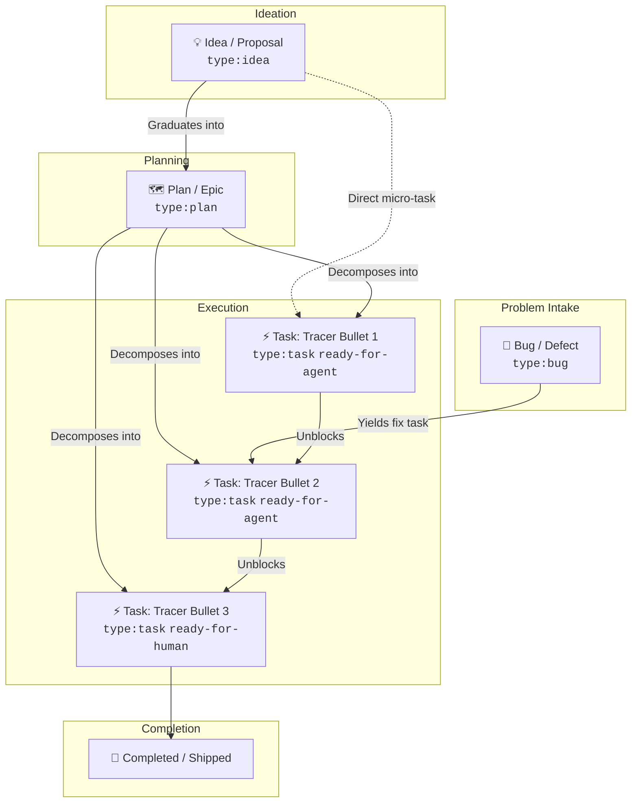

# Grepolis GitHub Issue Tracker Guide

This guide describes how Ideas, Plans, Issues/Bugs, and Implementations are tracked, managed, and automated on GitHub for this project.

---

## 1. The 4-Tier Hierarchy



### Tier Overview

| Tier | Type Label | Purpose | Key Content |
|---|---|---|---|
| **💡 Idea** | `type:idea` | Exploration & Brainstorming | Opportunity, proposed concept, tactical value, questions. |
| **🗺️ Plan** | `type:plan` | Architecture & Epic Roadmaps | Scope, domain seams (ADRs), vertical tracer slices, non-goals, risks. |
| **🐛 Bug** | `type:bug` | Problem & Incident Intake | Steps to reproduce, expected vs actual, world ID, logs/screenshots. |
| **⚡ Implementation** | `type:task` | Executable Tracer Bullet | End-to-end behavior, acceptance criteria, blockers, verification plan. |

---

## 2. Creating Issues

### A. Via GitHub Web UI
Navigate to GitHub Issues -> **New Issue**. You will be presented with structured forms:
1. **💡 Idea / Proposal**: Structured intake for game features and tactical overlays.
2. **🗺️ Plan / Epic / Architecture**: Architectural roadmaps and milestone trackers.
3. **🐛 Issue / Bug Report**: Reproducible bug reporting with environment context.
4. **⚡ Implementation / Task**: Tracer-bullet vertical slices.

### B. Via Project CLI Script
Use the built-in generator script:
```bash
# Propose an idea
node scripts/create-issue.js --type idea --title "Alliance Defense Heatmap" --area map --problem "Blind spots in ocean borders" --concept "Add Voronoi density shading"

# Create an architectural plan
node scripts/create-issue.js --type plan --title "Conquest Radar Overhaul" --area intel --objective "Refactor radar pipeline into WebGL shaders"

# File a bug
node scripts/create-issue.js --type bug --title "Transit curve offset at zoom 12" --area operations --priority high --desc "Curve jumps 128px" --repro "1. Open /map 2. Zoom to ocean 45"

# Create a task (Tracer bullet)
node scripts/create-issue.js --type task --title "Compute Bézier curve coordinates" --area operations --parent 42 --target ready-for-agent --blocked-by None
```

### C. Via `gh` CLI
```bash
gh issue create --title "[Task] Implement Voronoi cell calculations" \
  --label "type:task" --label "ready-for-agent" --label "area:map" \
  --body "Part of #42\n\n### What to Build\nCompute GPU Voronoi polygons\n\n### Blocked by\nNone"
```

---

## 3. Automated GitHub Actions Workflows

### 🤖 Automatic Triage (`.github/workflows/issue-triage.yml`)
- Automatically applies `type:*`, `area:*`, and `priority:*` based on title tags and issue form selections.
- Applies default `needs-triage` state to newly opened issues.
- When assigned, automatically removes `needs-triage`.
- When an issue is closed as `not_planned`, automatically tags `wontfix`.
- When an issue is in `needs-info` and the reporter replies with a comment, automatically returns the issue to `needs-triage`.

### ⚡ ChatOps Slash Commands (`.github/workflows/issue-commands.yml`)
You and agents can triage issues directly from comments:
- `/ready` or `/ready-agent` — Mark as `ready-for-agent` (clears other states).
- `/ready-human` — Mark as `ready-for-human`.
- `/needs-info` — Mark as `needs-info`.
- `/triage` — Reset back to `needs-triage`.
- `/claim` — Assign issue to yourself.
- `/unclaim` — Unassign yourself.
- `/wontfix` — Tag `wontfix` and close issue.
- `/priority <critical|high|normal|low>` — Set priority level.
- `/area <name>` — Add domain area tag.

### 🏷️ Label Synchronization (`.github/workflows/sync-labels.yml` & `npm run labels:sync`)
- Canonical label definitions reside in `.github/labels.yml`.
- Automatically synced to GitHub on commit to `main`, or run locally:
```bash
npm run labels:sync
```

---

## 4. Work Breakdown & Dependencies

For Plans and Implementations:
- **Tracer Bullets**: Each implementation slice cuts vertically across schema, API, UI, and tests.
- **Dependencies**: Declare blockers in the issue body (`Blocked by: #12, #14`) and/or via GitHub native issue dependencies (`gh api repos/<owner>/<repo>/issues/<child>/dependencies/blocked_by`).
- **Sub-Issues**: Parent-child relationship can be set with `gh issue edit <parent> --add-sub-issue <child>` or referenced via `Part of #<parent>`.
